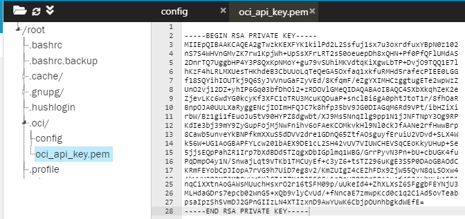

# Prepare OCI Tenancy

This and the next preparatory steps can (only) be performed by the user who is the tenancy owner or by another user who is member of Administrators Group. In this step, you will create a config file and a public/private key pair - required by the OCI CLI tool that you will be using in the other scenarios. You will use the Cloud Shell tool to get easy command line access to a number of tenancy specific values that are need for the config and private key files.


## Retrieve Configuration Values and Private Key
In the scenarios you will be using the OCI CLI (command line interface) on many occasions. You will use fairly simple, straightforward terminal commands with this CLI. This tool in turn interacts with the OCI REST APIs for querying and manipulating OCI resources. OCI CLI needs to be enabled to connect to your tenancy: it needs to know where your OCI tenancy is and how to connect to it. For this, two files need to be prepared:
* ~/.oci/config 
* ~/.oci/oci-api-key.pem

Empty versions of these two files are created as part of every scenario in this series. Look in the file explorer in directory /root/.oci for these two files. Click on *config* to open the empty file.

Here is an example of what the *config* file will look like; click on `Copy to Editor` to copy this content to the *config* file:

<pre class="file" data-filename="config" data-target="append">
[DEFAULT]
user=OCID FOR YOUR TENANCY OWNER USER OR OTHER ADMIN USER
fingerprint=FINGERPRINT FOR KEY FOR USER
tenancy=OCID FOR YOUR TENANCY
region=HOME REGION OF YOUR TENANCY
key_file=/root/.oci/oci_api_key.pem
</pre>

This step in the scenario will help you prepare these files and to add the public key half of the key pair you will generate to the OCI user. The private key half is used to make the OCI CLI work with OCI as the user. 

### Gather Configuration Values in Cloud Shell

Login to the OCI Cloud Console as the tenancy owner (or a user who is administrator). 

Open the OCI Cloud Shell tool, from the OCI Cloud Console.


Note: For clipboard operations, Windows users can use Ctrl-C or Ctrl-Insert to copy, and Shift-Insert to paste. For Mac OS users, use Cmd-C to copy and Cmd-V to paste.

Execute these commands in Cloud Shell to retrieve the OCID (Oracle Cloud Identifier) of the tenancy and the OCID of your user into environment variables, as well as the Region (name and key):
<pre class="file" data-target="clipboard">
export TENANCY_OCID=$(oci iam user list --all | jq -r  '.data[0]."compartment-id"') 
export USER_OCID=$(oci iam user list --all | jq -r  '.data |sort_by(."time-created")| .[0]."id"')
export REGION=$(oci iam region-subscription list | jq -r '.data[0]."region-name"')
export REGION_KEY=$(oci iam region-subscription list | jq -r '.data[0]."region-key"')
</pre>

Let's see if all values have been set as expected; execute this command in Cloud Shell:

<pre class="file" data-target="clipboard">
__config="user=$USER_OCID
tenancy=$TENANCY_OCID
region=$REGION
"
echo "$__config"
</pre>
You should now see values for user, tenancy and region. If not all of these three have a value, please repeat the the previous commands. 

### Generate Public & Private Key pair in Cloud Shell

Then - still in Cloud Shell - use the following statements to generate the key pair, upload the public key to the OCI user resource and retrieve the public key fingerprint:

<pre class="file" data-target="clipboard">
mkdir ~/oci-keys
openssl genrsa -out ~/oci-keys/oci_api_key.pem 2048
# generate public key
openssl rsa -pubout -in ~/oci-keys/oci_api_key.pem -out ~/oci-keys/oci_api_key_public.pem
# add public key to the OCI admin user
oci iam user api-key upload --user-id $USER_OCID  --key-file ~/oci-keys/oci_api_key_public.pem
# get fingerprint
export KEY_FINGERPRINT=$(oci iam user api-key list --user-id  $USER_OCID  | jq -r '.data[0]."fingerprint"')
</pre>


## Edit Config and Private Key File in Katacoda
You will now use the results of the actions in Cloud Shell for completing the configuration and private key file in Katacoda.

### Config File
In Cloud Shell, execute this command, to get the contents for the config file:

<pre class="file" data-target="clipboard">
__config="[DEFAULT]
user=$USER_OCID
fingerprint=$KEY_FINGERPRINT
tenancy=$TENANCY_OCID
region=$REGION
key_file=/root/.oci/oci_api_key.pem
"
echo "$__config"
</pre>

Select the output from this command in Cloud Shell and copy it to the clipboard (through right mouse menu or using Ctrl-C or Ctrl-Insert in Windows and Cmd-C on Mac OS).


Back in the Katacoda scenario: open file *~/.oci/config* in the text editor, and paste the contents from the clipboard into the file.

### Private Key File
In Cloud Shell, execute this command to list the contents of the private key and copy the contents to the clipboard. 

<pre class="file" data-target="clipboard">
cat ~/oci-keys/oci_api_key.pem
</pre>

Note: this is the private key that no one but you should have access to. We only need to show the contents so you can copy it to the clipboard and paste into a file in the Katacoda scenario.


Back in the Katacoda scenario: open file *~/.oci/oci-api-key.pem* in the text editor, and paste the contents from the clipboard into the file.


## Try out the OCI CLI connection to your Tenancy
To make sure that the *config* file and the *oci-api-key.pem* file have the correct contents, try out the following command to get a list of all namespaces you currently have access to - based on the OCI Configuration defined above.

`oci os ns get`{{execute}} 

If this command gives a proper response, the configuration is most likely correct.

Another test - listing all users in your OCI tenancy:

`oci iam user list --all`{{execute}}

Set environment variables in the Katacoda environment with the Tenancy OCID, the region name and the region key:

```
export TENANCY_OCID=$(oci iam user list --all | jq -r  '.data[0]."compartment-id"')
export REGION=$(oci iam region-subscription list | jq -r '.data[0]."region-name"')
export REGION_KEY=$(oci iam region-subscription list | jq -r '.data[0]."region-key"')
```{{execute}}

Note: the following syntax will be used to use the lowercase value for region:
`echo ${REGION,,}`{{execute}}